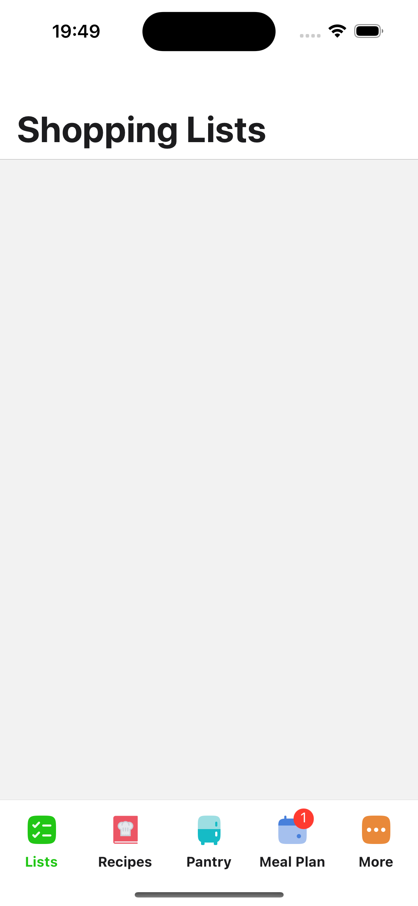
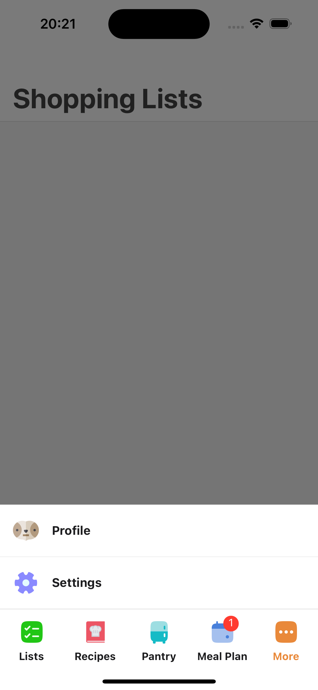

# Custom React Navigation Bottom Tabs

 [](https://expo.io/)

This extension to @react-navigation/bottom-tabs introduces a seamless solution for managing a large number of tabs. When the tabs exceed a specified limit, the last tab automatically transforms into a 'More' tab, revealing a Bottom Sheet with the remaining tabs.

**Inspired by:**

<a href="https://www.duolingo.com/"></a>

## Screenshots

<p float="left">
  
  
</p>

## Setup

Add this line to `package.json` in `dependencies` section:

```json
"@swanstack/react-navigation-bottom-tabs": "git+ssh://git@github.com:swanstack/react-navigation-bottom-tabs.git"
```

## Usage

```tsx
import { createBottomTabNavigator } from '@swanstack/react-navigation-bottom-tabs';

const Tab = createBottomTabNavigator();

const MyTabs = () => {
  return (
    <Tab.Navigator
      initialRouteName="List"
      screenOptions={{
        tabBarMaxVisibleTabs: 5, // add this line
      }}
    >
      <Tab.Screen name="List" component={ListScreen} />
      <Tab.Screen name="Recipe" component={RecipeScreen} />
      <Tab.Screen name="Pantry" component={PantryScreen} />
      <Tab.Screen name="MealPlan" component={MealPlanScreen} />
      <Tab.Screen name="Profile" component={ProfileScreen} />
      <Tab.Screen name="Settings" component={SettingsScreen} />
    </Tab.Navigator>
  );
};
```

## Properties

| Property                                                                                     | Description                                                     | Type                                            | Default Value                                       |
| -------------------------------------------------------------------------------------------- | --------------------------------------------------------------- | ----------------------------------------------- | --------------------------------------------------- |
| ... (the original [properties](https://reactnavigation.org/docs/bottom-tab-navigator#props)) | ... (directly related to `@react-navigation/bottom-tabs`)       | -                                               | -                                                   |
| `tabBarMaxVisibleTabs`                                                                       | Max visible tabs including "More" tab.                          | `number`                                        | 4                                                   |
| `tabBarPulseOnPress`                                                                         | Enable pulse animation on tab press.                            | `boolean`                                       | true                                                |
| `tabBarIconSize`                                                                             | Size of the tab bar icons.                                      | `number`                                        | 28                                                  |
| `tabBarMoreAccessibilityLabel`                                                               | Accessibility label for the "More" tab.                         | `string`                                        | -                                                   |
| `tabBarMoreTestID`                                                                           | TestID for the "More" tab.                                      | `string`                                        | -                                                   |
| `tabBarMoreShowLabel`                                                                        | Show label for the "More" tab.                                  | `boolean`                                       | `tabBarShowLabel` \| true                           |
| `tabBarMoreAllowFontScaling`                                                                 | Allow font scaling for the "More" tab label.                    | `boolean`                                       | `tabBarAllowFontScaling` \| -                       |
| `tabBarMoreActiveTintColor`                                                                  | Active tint color for the "More" tab.                           | `string`                                        | `tabBarActiveTintColor` \| Primary color from theme |
| `tabBarMoreInactiveTintColor`                                                                | Inactive tint color for the "More" tab.                         | `string`                                        | `tabBarInactiveTintColor` \| Text color from theme  |
| `tabBarMoreActiveBackgroundColor`                                                            | Active background color for the "More" tab.                     | `string`                                        | `tabBarActiveBackgroundColor` \| 'transparent'      |
| `tabBarMoreInactiveBackgroundColor`                                                          | Inactive background color for the "More" tab.                   | `string`                                        | `tabBarInactiveBackgroundColor` \| 'transparent'    |
| `tabBarMoreButton`                                                                           | Custom component for the "More" tab button.                     | `(props: BottomTabBarButtonProps) => ReactNode` | -                                                   |
| `tabBarMoreItemStyle`                                                                        | Style for the "More" tab item.                                  | `style`                                         | `tabBarItemStyle` \| -                              |
| `tabBarMoreIcon`                                                                             | Custom icon for the "More" tab.                                 | `(props: BottomTabBarIconProps) => ReactNode`   | -                                                   |
| `tabBarMoreIconStyle`                                                                        | Style for the "More" tab icon.                                  | `style`                                         | `tabBarIconStyle` \| -                              |
| `tabBarMoreIconSize`                                                                         | Size of the "More" tab icon.                                    | `number`                                        | `tabBarIconSize` \| 28                              |
| `tabBarMoreLabel`                                                                            | Custom label for the "More" tab.                                | `string`                                        | 'More'                                              |
| `tabBarMoreLabelStyle`                                                                       | Style for the "More" tab label.                                 | `style`                                         | `tabBarLabelStyle` \| -                             |
| `tabBarMoreBadge`                                                                            | Badge for the "More" tab.                                       | `(props: BottomTabBarBadgeProps) => ReactNode`  | -                                                   |
| `tabBarMoreBadgeStyle`                                                                       | Style for the badge on the "More" tab.                          | `style`                                         | `tabBarBadgeStyle` \| -                             |
| `tabBarMoreBottomSheetBackdropStyle`                                                         | Style for the backdrop of the Bottom Sheet in "More" tab.       | `style`                                         | -                                                   |
| `tabBarMoreBottomSheetModalStyle`                                                            | Style for the modal of the Bottom Sheet in "More" tab.          | `style`                                         | -                                                   |
| `tabBarMoreBottomSheetActiveTintColor`                                                       | Active tint color for Bottom Sheet items in "More" tab.         | `string`                                        | `tabBarActiveTintColor` \| Primary color from theme |
| `tabBarMoreBottomSheetInactiveTintColor`                                                     | Inactive tint color for Bottom Sheet items in "More" tab.       | `string`                                        | `tabBarInactiveTintColor` \| Text color from theme  |
| `tabBarMoreBottomSheetActiveBackgroundColor`                                                 | Active background color for Bottom Sheet items in "More" tab.   | `string`                                        | `tabBarActiveBackgroundColor` \| 'transparent'      |
| `tabBarMoreBottomSheetInactiveBackgroundColor`                                               | Inactive background color for Bottom Sheet items in "More" tab. | `string`                                        | `tabBarInactiveBackgroundColor` \| 'transparent'    |
| `tabBarMoreBottomSheetButton`                                                                | Custom component for Bottom Sheet items in "More" tab.          | `(props: BottomTabBarButtonProps) => ReactNode` | -                                                   |
| `tabBarMoreBottomSheetItemStyle`                                                             | Style for Bottom Sheet items in "More" tab.                     | `style`                                         | `tabBarItemStyle` \| -                              |
| `tabBarMoreBottomSheetIcon`                                                                  | Custom icon for Bottom Sheet item in "More" tab.                | `(props: BottomTabBarIconProps) => ReactNode`   | -                                                   |
| `tabBarMoreBottomSheetIconStyle`                                                             | Style for Bottom Sheet icons in "More" tab.                     | `style`                                         | `tabBarIconStyle` \| -                              |
| `tabBarMoreBottomSheetIconSize`                                                              | Size of Bottom Sheet icons in "More" tab.                       | `number`                                        | `tabBarIconSize` \| 28                              |
| `tabBarMoreBottomSheetLabel`                                                                 | Custom label for Bottom Sheet item in "More" tab.               | `string`                                        | `tabBarLabel` \| -                                  |
| `tabBarMoreBottomSheetLabelStyle`                                                            | Style for Bottom Sheet labels in "More" tab.                    | `style`                                         | `tabBarLabelStyle` \| -                             |
| `tabBarMoreBottomSheetBadgeStyle`                                                            | Style for badges on Bottom Sheet items in "More" tab.           | `style`                                         | `tabBarBadgeStyle` \| -                             |

### Not supported original properties from `@react-navigation/bottom-tabs`

| Property                          | Supported           |
| --------------------------------- | ------------------- |
| `tabBarHideOnKeyboard`            | ❌ (Not applicable) |
| `tabBarVisibilityAnimationConfig` | ❌ (Not applicable) |

## Full Example

```tsx
import * as React from 'react';
import { StyleSheet, View } from 'react-native';
import {
  NavigationContainer,
  type CompositeScreenProps,
  type NavigatorScreenParams,
} from '@react-navigation/native';
import {
  createNativeStackNavigator,
  type NativeStackScreenProps,
} from '@react-navigation/native-stack';
import {
  createBottomTabNavigator,
  type BottomTabScreenProps,
} from '@swanstack/react-navigation-bottom-tabs';

/* Your Param List */

type MyTabsParamList = {
  List: undefined;
  Recipe: undefined;
  Pantry: undefined;
  MealPlan: undefined;
  Profile: undefined;
  Settings: undefined;
};

type RootStackParamList = {
  MyTabs: NavigatorScreenParams<MyTabsParamList>;
};

export type RootStackScreenProps<R extends keyof RootStackParamList> =
  NativeStackScreenProps<RootStackParamList, R>;

/* MyTabs is a nested navigator within the RootStack navigator */

export type MyTabsScreenProps<R extends keyof MyTabsParamList> =
  CompositeScreenProps<
    BottomTabScreenProps<MyTabsParamList, R>,
    NativeStackScreenProps<RootStackParamList>
  >;

/* Your Screens */

const ListScreen = (props: MyTabsScreenProps<'List'>) => {
  return <View />;
};

const RecipeScreen = (props: MyTabsScreenProps<'Recipe'>) => {
  return <View />;
};

const PantryScreen = (props: MyTabsScreenProps<'Pantry'>) => {
  return <View />;
};

const MealPlanScreen = (props: MyTabsScreenProps<'MealPlan'>) => {
  return <View />;
};

const ProfileScreen = (props: MyTabsScreenProps<'Profile'>) => {
  return <View />;
};

const SettingsScreen = (props: MyTabsScreenProps<'Settings'>) => {
  return <View />;
};

const Tab = createBottomTabNavigator<MyTabsParamList>();

const MyTabs = () => {
  return (
    <Tab.Navigator
      initialRouteName="List"
      screenOptions={{
        tabBarMaxVisibleTabs: 5,
      }}
    >
      <Tab.Screen name="List" component={ListScreen} />
      <Tab.Screen name="Recipe" component={RecipeScreen} />
      <Tab.Screen name="Pantry" component={PantryScreen} />
      <Tab.Screen name="MealPlan" component={MealPlanScreen} />
      <Tab.Screen name="Profile" component={ProfileScreen} />
      <Tab.Screen name="Settings" component={SettingsScreen} />
    </Tab.Navigator>
  );
};

const RootStack = createNativeStackNavigator<RootStackParamList>();

export default function App() {
  return (
    <View style={styles.container}>
      <NavigationContainer>
        <RootStack.Navigator>
          <RootStack.Screen
            name="MyTabs"
            component={MyTabs}
            options={{ headerShown: false }}
          />
        </RootStack.Navigator>
      </NavigationContainer>
    </View>
  );
}

const styles = StyleSheet.create({
  container: {
    flex: 1,
  },
});
```

## Contributing

See the [contributing guide](CONTRIBUTING.md) to learn how to contribute to the repository and the development workflow.

## License

MIT

---

Made with [create-react-native-library](https://github.com/callstack/react-native-builder-bob)
